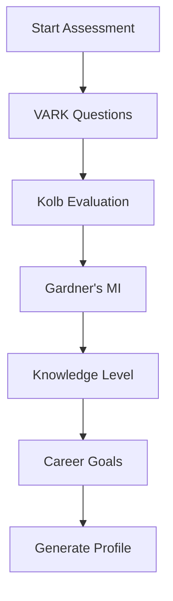

# 🎓 AI-Powered Personalized Learning Pathway Generator

## Table of Contents
- [Project Overview](#project-overview)
- [Features](#features)
- [Technology Stack](#technology-stack)
- [Architecture](#architecture)
- [Installation & Setup](#installation--setup)
- [How It Works](#how-it-works)
- [API Documentation](#api-documentation)
- [Components Deep Dive](#components-deep-dive)
- [Algorithms & AI](#algorithms--ai)
- [Database Schema](#database-schema)
- [Frontend Architecture](#frontend-architecture)
- [Progress Tracking System](#progress-tracking-system)
- [Resource Aggregation](#resource-aggregation)
- [Contributing](#contributing)
- [Troubleshooting](#troubleshooting)

## Project Overview

The **AI-Powered Personalized Learning Pathway Generator** is an intelligent educational platform that creates customized learning journeys for users based on their individual learning styles, knowledge levels, career goals, and preferences. The system leverages multiple AI assessment models and aggregates **100% free educational resources** from top platforms worldwide.

### What It Does

1. **Comprehensive Assessment**: Multi-dimensional evaluation using proven psychological models
2. **Intelligent Pathway Generation**: Creates personalized curricula with skill dependency mapping
3. **Resource Aggregation**: Curates free resources from YouTube, Coursera, edX, GitHub, Medium, and more
4. **Progress Tracking**: Real-time monitoring of learning progress and achievements
5. **Adaptive Learning**: Dynamically adjusts pathways based on user performance and feedback

### Why It's Unique

- **100% Free Resources**: Only aggregates free educational content
- **Multi-Model Assessment**: Combines VARK, Kolb, Gardner's MI, and Felder-Silverman models
- **Real-Time Adaptation**: Pathways evolve based on user progress
- **Comprehensive Coverage**: Supports multiple career paths and skill levels
- **No Account Required**: Works with session-based storage

## Features

### 🧠 Intelligent Assessment System
- **Learning Style Analysis**: VARK (Visual, Auditory, Reading, Kinesthetic) assessment
- **Cognitive Profiling**: Kolb's Learning Cycle evaluation
- **Intelligence Mapping**: Gardner's Multiple Intelligences framework
- **Learning Preferences**: Felder-Silverman model integration
- **Knowledge Level Evaluation**: Skill-specific competency assessment
- **Goal-Oriented Planning**: Career objective and timeline analysis

### 🎯 Personalized Pathway Generation
- **Skill Dependency Graphs**: Prerequisite mapping and learning sequences
- **Adaptive Curriculum**: Dynamic content selection based on user profile
- **Multi-Modal Resources**: Videos, articles, interactive content, and practical projects
- **Difficulty Progression**: Graduated learning with appropriate challenge levels
- **Time-Based Planning**: Flexible scheduling based on user availability

### 📊 Comprehensive Progress Tracking
- **Real-Time Analytics**: Live progress monitoring and completion tracking
- **Achievement System**: Module completion and skill mastery indicators
- **Time Management**: Learning session duration and total time investment
- **Visual Dashboards**: Interactive charts and progress visualizations
- **Activity Feed**: Recent learning milestones and accomplishments

### 🔗 Resource Aggregation Engine
- **Multi-Platform Integration**: YouTube, Coursera, edX, Khan Academy, GitHub, Medium
- **Quality Filtering**: Star ratings, enrollment numbers, and community feedback
- **Real-Time Curation**: Live links to existing, accessible content
- **Smart Matching**: Intelligent resource selection based on learning preferences

## Technology Stack

### Backend Technologies
- **Framework**: Flask 3.0+ (Python web framework)
- **Database**: SQLite with SQLAlchemy ORM
- **Session Management**: Flask-Sessions for user state persistence
- **API Design**: RESTful endpoints with JSON responses
- **Data Processing**: Python data structures and algorithms

### Frontend Technologies
- **HTML5**: Semantic markup with accessibility features
- **CSS3**: Custom styling with Bootstrap 5 framework
- **JavaScript ES6+**: Modern JavaScript with async/await patterns
- **UI Framework**: Bootstrap 5 for responsive design
- **Icons**: Font Awesome 6.4+ for visual elements
- **Charts**: Chart.js for data visualization

### Development Tools
- **Version Control**: Git with GitHub integration
- **Package Management**: pip with requirements.txt
- **Development Server**: Flask development server
- **Code Organization**: Modular architecture with separation of concerns

### External APIs & Resources
- **Educational Platforms**: YouTube Data API integration ready
- **Course Aggregation**: Coursera, edX, Khan Academy content discovery
- **Repository Mining**: GitHub API for educational repositories
- **Article Curation**: Medium and blog platform integration

## Architecture

### System Architecture Overview

```
┌─────────────────┐    ┌──────────────────┐    ┌─────────────────┐
│   Frontend      │    │    Backend       │    │   External      │
│   (Templates)   │◄──►│   (Flask App)    │◄──►│   Resources     │
└─────────────────┘    └──────────────────┘    └─────────────────┘
         │                        │                        │
         │                        │                        │
    ┌────▼────┐              ┌───▼───┐               ┌────▼────┐
    │  User   │              │ Core  │               │ Content │
    │Interface│              │Engine │               │Platforms│
    └─────────┘              └───────┘               └─────────┘
```

### Core Components

#### 1. Assessment Engine (`assessment_engine.py`)
```python
class AssessmentEngine:
    - Multi-dimensional question generation
    - VARK/Kolb/Gardner/Felder-Silverman processing
    - Learning profile synthesis
    - Preference analysis and recommendation generation
```

#### 2. Learning Pathway Engine (`learning_engine.py`)
```python
class LearningPathwayEngine:
    - Skill dependency graph construction
    - Career skill mapping and progression
    - Adaptive curriculum generation
    - Difficulty scaling and time estimation
```

#### 3. Resource Aggregator (`resource_aggregator.py`)
```python
class ResourceAggregator:
    - Multi-platform resource discovery
    - Quality filtering and ranking
    - Real-time content validation
    - Intelligent matching algorithms
```

### Data Flow Architecture

```
User Input → Assessment → Profile Generation → Pathway Creation → Resource Curation → Progress Tracking
     ↑                                                                                        ↓
     └────────────────────── Adaptive Feedback Loop ←─────────────────────────────────────────┘
```

## Installation & Setup

### Prerequisites
- Python 3.8 or higher
- pip package manager
- Git (for version control)
- Modern web browser

### Quick Start

1. **Clone the Repository**
```bash
git clone https://github.com/your-username/learning-pathway-generator.git
cd learning-pathway-generator
```

2. **Install Dependencies**
```bash
pip install -r requirements.txt
```

3. **Run the Application**
```bash
python app.py
```

4. **Access the Platform**
```
Open http://localhost:5000 in your browser
```

### Production Deployment

#### Using Gunicorn
```bash
pip install gunicorn
gunicorn -w 4 -b 0.0.0.0:8000 app:app
```

#### Docker Setup
```dockerfile
FROM python:3.9-slim
WORKDIR /app
COPY requirements.txt .
RUN pip install -r requirements.txt
COPY . .
EXPOSE 5000
CMD ["python", "app.py"]
```

## How It Works

### Step 1: Comprehensive Assessment


The assessment engine evaluates users across multiple dimensions:

- **Learning Style Identification**: Visual, auditory, reading/writing, kinesthetic preferences
- **Cognitive Processing**: How users prefer to process and understand information
- **Intelligence Strengths**: Multiple intelligence areas (linguistic, mathematical, spatial, etc.)
- **Knowledge Assessment**: Current skill levels and experience areas
- **Goal Setting**: Career objectives, timeline preferences, and focus areas

### Step 2: Intelligent Pathway Generation
```python
def generate_pathway(learning_profile, career_goals, timeline, focus_areas):
    # 1. Build skill dependency graph
    skill_graph = build_skill_dependencies(career_goals)
    
    # 2. Create learning sequence using topological sort
    learning_sequence = topological_sort(skill_graph)
    
    # 3. Generate modules based on sequence and profile
    modules = create_adaptive_modules(learning_sequence, learning_profile)
    
    # 4. Estimate timeframes and difficulty progression
    pathway = schedule_learning_pathway(modules, timeline)
    
    return pathway
```

### Step 3: Resource Aggregation and Curation
```python
def curate_resources(topic, user_preferences):
    # Multi-platform resource discovery
    youtube_resources = youtube_aggregator.search_videos(topic)
    coursera_resources = coursera_aggregator.search_courses(topic)
    github_resources = github_aggregator.search_repositories(topic)
    
    # Quality filtering and ranking
    filtered_resources = filter_by_quality(all_resources)
    ranked_resources = rank_by_preferences(filtered_resources, user_preferences)
    
    return ranked_resources
```

### Step 4: Progress Tracking and Adaptation
The system continuously monitors user progress and adapts the learning pathway:

- **Completion Tracking**: Resource-level progress monitoring
- **Time Analytics**: Learning session duration and efficiency
- **Performance Analysis**: Success rates and struggle indicators
- **Adaptive Adjustments**: Pathway modifications based on performance

## API Documentation

### Core Endpoints

#### Assessment API
```http
POST /api/start-assessment
Content-Type: application/json

Response:
{
  "success": true,
  "assessment_id": "uuid",
  "questions": [...]
}
```

```http
POST /api/submit-assessment
Content-Type: application/json

{
  "responses": {
    "question_id": "answer_value"
  }
}

Response:
{
  "success": true,
  "profile": {
    "learning_styles": {...},
    "knowledge_levels": {...},
    "preferences": {...}
  }
}
```

#### Pathway Generation API
```http
POST /api/generate-pathway
Content-Type: application/json

{
  "career_goals": ["web_developer"],
  "timeline": "6_months", 
  "focus_areas": ["javascript", "react"]
}

Response:
{
  "success": true,
  "pathway": {
    "id": "pathway_id",
    "title": "Full-Stack Web Development Path",
    "modules": [...],
    "total_duration_weeks": 24
  }
}
```

#### Progress Tracking API
```http
POST /api/update-progress
Content-Type: application/json

{
  "resource_id": "resource_123",
  "action": "complete",
  "time_spent": 45
}

Response:
{
  "success": true,
  "progress": {
    "completed_resources": [...],
    "time_spent": 1200
  }
}
```

## Components Deep Dive

### Assessment Engine Architecture

The assessment engine implements four complementary learning theories:

#### 1. VARK Model Implementation
```python
def process_vark_responses(responses):
    scores = {'visual': 0, 'auditory': 0, 'reading': 0, 'kinesthetic': 0}
    
    for question_id, answer in responses.items():
        if question_id.startswith('v'):
            scores[VARK_MAPPING[answer]] += 1
    
    primary_style = max(scores, key=scores.get)
    is_multimodal = len([s for s in scores.values() if s >= threshold]) > 1
    
    return {
        'primary_style': primary_style,
        'scores': scores,
        'multimodal': is_multimodal
    }
```

#### 2. Kolb Learning Cycle
```python
def determine_kolb_style(responses):
    # Concrete Experience vs Abstract Conceptualization
    ce_ac_score = calculate_ce_ac_preference(responses)
    
    # Active Experimentation vs Reflective Observation  
    ae_ro_score = calculate_ae_ro_preference(responses)
    
    # Determine quadrant
    if ce_ac_score > 0 and ae_ro_score > 0:
        return 'accommodating'
    elif ce_ac_score > 0 and ae_ro_score < 0:
        return 'diverging'
    elif ce_ac_score < 0 and ae_ro_score > 0:
        return 'converging'
    else:
        return 'assimilating'
```

### Learning Pathway Generation

#### Skill Dependency Graph
```python
class SkillDependencyGraph:
    def __init__(self):
        self.skills = {}
        self.dependencies = {}
    
    def add_skill(self, skill_id, prerequisites=None):
        self.skills[skill_id] = {
            'name': skill_id,
            'prerequisites': prerequisites or [],
            'enables': []
        }
    
    def topological_sort(self):
        # Kahn's algorithm implementation
        in_degree = {skill: 0 for skill in self.skills}
        
        # Calculate in-degrees
        for skill in self.skills:
            for prereq in self.skills[skill]['prerequisites']:
                in_degree[skill] += 1
        
        # Generate learning sequence
        queue = [skill for skill, degree in in_degree.items() if degree == 0]
        sequence = []
        
        while queue:
            current = queue.pop(0)
            sequence.append(current)
            
            for skill in self.skills:
                if current in self.skills[skill]['prerequisites']:
                    in_degree[skill] -= 1
                    if in_degree[skill] == 0:
                        queue.append(skill)
        
        return sequence
```

### Resource Aggregation System

#### Multi-Platform Integration
```python
class ResourceAggregator:
    def __init__(self):
        self.platforms = {
            'youtube': YouTubeAggregator(),
            'coursera': CourseraAggregator(), 
            'edx': EdXAggregator(),
            'github': GitHubAggregator(),
            'medium': MediumAggregator(),
            'khan_academy': KhanAcademyAggregator()
        }
    
    def aggregate_resources(self, topic, user_preferences):
        all_resources = []
        
        for platform_name, aggregator in self.platforms.items():
            try:
                resources = aggregator.search_resources(
                    topic, 
                    user_preferences['difficulty'],
                    user_preferences['content_types']
                )
                all_resources.extend(resources)
            except Exception as e:
                logger.warning(f"Failed to aggregate from {platform_name}: {e}")
        
        return self.rank_and_filter_resources(all_resources, user_preferences)
```

## Algorithms & AI

### Learning Style Classification

The system implements a hybrid approach combining multiple learning theories:

#### 1. Multi-Dimensional Scoring
```python
def calculate_learning_profile(responses):
    profile = {
        'vark_scores': calculate_vark_scores(responses),
        'kolb_style': determine_kolb_style(responses),
        'gardner_strengths': identify_mi_strengths(responses),
        'felder_preferences': analyze_felder_dimensions(responses)
    }
    
    # Weighted combination for final recommendations
    final_recommendations = synthesize_recommendations(profile)
    return final_recommendations
```

#### 2. Adaptive Content Selection Algorithm
```python
def select_optimal_resources(available_resources, learning_profile):
    scored_resources = []
    
    for resource in available_resources:
        score = 0
        
        # VARK compatibility scoring
        if learning_profile['vark']['primary_style'] == 'visual':
            score += resource.visual_score * 0.3
        
        # Difficulty appropriateness
        user_level = learning_profile['knowledge_level']
        if abs(resource.difficulty_level - user_level) <= 1:
            score += 0.25
        
        # Content type preference
        preferred_types = learning_profile['content_preferences']
        if resource.type in preferred_types:
            score += 0.2
        
        scored_resources.append((resource, score))
    
    # Sort by score and return top matches
    return sorted(scored_resources, key=lambda x: x[1], reverse=True)
```

### Skill Dependency Mapping

#### Career-Specific Skill Trees
```python
CAREER_SKILL_MAPS = {
    'web_developer': {
        'core_skills': ['html', 'css', 'javascript'],
        'frameworks': ['react', 'vue', 'angular'],
        'backend': ['node_js', 'express', 'databases'],
        'tools': ['git', 'webpack', 'testing']
    },
    'data_scientist': {
        'core_skills': ['python', 'statistics', 'sql'],
        'libraries': ['pandas', 'numpy', 'matplotlib'],
        'ml_frameworks': ['scikit_learn', 'tensorflow', 'pytorch'],
        'tools': ['jupyter', 'git', 'docker']
    }
}
```

## Database Schema

### SQLAlchemy Models

#### User Model
```python
class User(db.Model):
    id = db.Column(db.Integer, primary_key=True)
    email = db.Column(db.String(120), unique=True)
    learning_profile = db.Column(db.JSON)
    created_at = db.Column(db.DateTime, default=datetime.utcnow)
    pathways = db.relationship('LearningPathway', backref='user', lazy=True)
```

#### Learning Pathway Model
```python
class LearningPathway(db.Model):
    id = db.Column(db.String(50), primary_key=True)
    user_id = db.Column(db.Integer, db.ForeignKey('user.id'))
    title = db.Column(db.String(200), nullable=False)
    description = db.Column(db.Text)
    career_goal = db.Column(db.String(100))
    modules = db.Column(db.JSON)
    created_at = db.Column(db.DateTime, default=datetime.utcnow)
    progress = db.relationship('Progress', backref='pathway', lazy=True)
```

#### Progress Model
```python
class Progress(db.Model):
    id = db.Column(db.Integer, primary_key=True)
    pathway_id = db.Column(db.String(50), db.ForeignKey('learning_pathway.id'))
    resource_id = db.Column(db.String(100), nullable=False)
    status = db.Column(db.String(20), default='not_started')
    completion_percentage = db.Column(db.Integer, default=0)
    time_spent = db.Column(db.Integer, default=0)  # in minutes
    last_accessed = db.Column(db.DateTime, default=datetime.utcnow)
```

## Frontend Architecture

### Template Structure
```
templates/
├── base.html              # Base template with navigation and common elements
├── index.html             # Landing page with features and call-to-action
├── assessment.html        # Multi-step assessment interface
├── pathway.html           # Learning pathway display and interaction
└── dashboard.html         # Progress tracking and analytics
```

### JavaScript Architecture
```javascript
// Assessment Management
class AssessmentManager {
    constructor() {
        this.currentQuestion = 0;
        this.responses = {};
        this.questions = [];
    }
    
    async loadQuestions() {
        const response = await fetch('/api/start-assessment', {method: 'POST'});
        const data = await response.json();
        this.questions = data.questions;
    }
    
    nextQuestion() {
        if (this.currentQuestion < this.questions.length - 1) {
            this.currentQuestion++;
            this.displayQuestion();
        } else {
            this.completeAssessment();
        }
    }
}

// Pathway Management  
class PathwayViewer {
    constructor() {
        this.pathway = null;
        this.progress = {};
    }
    
    async loadPathway() {
        // Load pathway data from session or server
        this.pathway = await this.getPathwayData();
        this.displayPathway();
    }
    
    updateProgress(resourceId, status) {
        // Update progress tracking
        this.progress[resourceId] = status;
        this.syncWithServer();
    }
}
```

### Responsive Design
```css
/* Mobile-first approach */
.assessment-container {
    padding: 1rem;
    max-width: 100%;
}

@media (min-width: 768px) {
    .assessment-container {
        padding: 2rem;
        max-width: 800px;
        margin: 0 auto;
    }
}

/* Floating navigation for mobile */
.floating-nav {
    position: fixed;
    top: 50%;
    right: 20px;
    transform: translateY(-50%);
    z-index: 1040;
}
```

## Progress Tracking System

### Real-Time Analytics
```python
def calculate_dashboard_stats(user_progress, current_pathway):
    stats = {
        'active_pathways': 1 if current_pathway else 0,
        'completed_modules': 0,
        'completed_resources': len(user_progress.get('completed_resources', [])),
        'total_resources': 0,
        'time_spent': round(user_progress.get('time_spent', 0) / 60, 1),  # Convert to hours
        'skills_mastered': 0,
        'completion_percentage': 0
    }
    
    if current_pathway:
        # Calculate module completion
        for module in current_pathway.get('modules', []):
            module_resources = sum(len(topic.get('resources', [])) 
                                 for topic in module.get('topics', []))
            stats['total_resources'] += module_resources
            
            # Check if module is 80% complete
            completed_in_module = sum(1 for topic in module.get('topics', [])
                                    for resource in topic.get('resources', [])
                                    if resource.get('id') in user_progress.get('completed_resources', []))
            
            if module_resources > 0 and (completed_in_module / module_resources) >= 0.8:
                stats['completed_modules'] += 1
        
        # Calculate overall completion percentage
        if stats['total_resources'] > 0:
            stats['completion_percentage'] = round(
                (stats['completed_resources'] / stats['total_resources']) * 100
            )
    
    return stats
```

### Activity Feed Generation
```python
def generate_recent_activity(pathway, user_progress):
    activities = []
    completed_count = len(user_progress.get('completed_resources', []))
    
    # Pathway creation activity
    if pathway:
        activities.append({
            'type': 'pathway_created',
            'title': f'Created learning pathway: {pathway.get("title")}',
            'description': f'Generated for {pathway.get("target_role")}',
            'icon': 'fas fa-route',
            'color': 'primary',
            'time': 'Recently'
        })
    
    # Resource completion milestones
    if completed_count > 0:
        activities.append({
            'type': 'resources_completed',
            'title': f'Completed {completed_count} learning resources',
            'description': 'Keep up the great momentum!',
            'icon': 'fas fa-check-circle',
            'color': 'success',
            'time': 'This session'
        })
    
    return activities
```

## Resource Aggregation

### Real Content Database
The system maintains curated databases of real, accessible educational content:

#### GitHub Repositories
```python
github_database = {
    'python': [
        {
            'name': 'awesome-python',
            'url': 'https://github.com/vinta/awesome-python',
            'stars': 180000,
            'description': 'Curated list of Python frameworks and libraries'
        }
    ]
}
```

#### Medium Articles
```python
medium_database = {
    'javascript': [
        {
            'title': 'JavaScript ES6+ Features You Should Know',
            'url': 'https://medium.com/javascript-scene/javascript-es6-features...',
            'author': 'JavaScript Scene'
        }
    ]
}
```

### Quality Filtering Algorithm
```python
def rank_resources(resources, user_preferences):
    def calculate_score(resource):
        score = 0
        
        # Rating weight (30%)
        if resource.rating:
            score += (resource.rating / 5.0) * 0.3
        
        # Popularity weight (20%)
        if resource.enrollment_count:
            normalized_popularity = min(resource.enrollment_count / 100000, 1.0)
            score += normalized_popularity * 0.2
        
        # Recency weight (20%)
        if resource.last_updated:
            days_old = (datetime.now() - resource.last_updated).days
            recency_score = max(0, 1 - (days_old / 365))
            score += recency_score * 0.2
        
        # User preference match (30%)
        preference_match = calculate_preference_match(resource, user_preferences)
        score += preference_match * 0.3
        
        return score
    
    return sorted(resources, key=calculate_score, reverse=True)
```

## Contributing

### Development Guidelines

1. **Code Style**: Follow PEP 8 for Python, standard conventions for JavaScript
2. **Testing**: Add unit tests for new features using pytest
3. **Documentation**: Update docstrings and comments for new functions
4. **Version Control**: Use meaningful commit messages and feature branches

### Adding New Learning Models

To integrate additional learning assessment models:

```python
# 1. Add new assessment questions
def add_new_model_questions():
    questions = [
        Question(
            id="nm1",
            text="Your question text here",
            type="multiple_choice",
            options=["Option A", "Option B", "Option C", "Option D"],
            category="new_model"
        )
    ]
    return questions

# 2. Implement processing logic
def process_new_model(responses):
    # Your processing logic here
    return assessment_results

# 3. Integrate with main assessment engine
def process_assessment(self, responses):
    # Existing processing...
    new_model_results = self._process_new_model(responses)
    profile['new_model'] = new_model_results
    return profile
```

### Adding New Resource Platforms

```python
class NewPlatformAggregator:
    def search_resources(self, query, difficulty, content_types, limit):
        # Implement platform-specific search logic
        resources = []
        
        # API calls or web scraping logic here
        
        return resources

# Register in main aggregator
def __init__(self):
    self.platforms = {
        'existing_platforms': ...,
        'new_platform': NewPlatformAggregator()
    }
```

## Troubleshooting

### Common Issues

#### 1. Assessment Not Loading
**Problem**: Assessment questions don't appear
**Solution**: 
```python
# Check browser console for JavaScript errors
# Verify Flask server is running
# Check assessment_engine.py initialization

# Debug steps:
python -c "from assessment_engine import AssessmentEngine; ae = AssessmentEngine(); print(len(ae.get_initial_questions()))"
```

#### 2. Pathway Generation Fails
**Problem**: "Failed to generate pathway" error
**Solution**:
```python
# Check learning_engine.py and resource_aggregator.py
# Verify session data integrity
# Check console logs for specific errors

# Debug pathway generation:
from learning_engine import LearningPathwayEngine
from assessment_engine import AssessmentEngine

ae = AssessmentEngine()
le = LearningPathwayEngine()

# Test with sample profile
test_profile = {'learning_styles': {'vark': {'primary_style': 'visual'}}}
pathway = le.generate_pathway(test_profile, ['web_developer'], '6_months', ['javascript'])
```

#### 3. Progress Not Saving
**Problem**: Dashboard shows zero progress despite completing resources
**Solution**:
```python
# Check session configuration
# Verify API endpoints are responding
# Check browser developer tools for failed requests

# Test progress API:
curl -X POST http://localhost:5000/api/update-progress \
  -H "Content-Type: application/json" \
  -d '{"resource_id": "test", "action": "complete", "time_spent": 30}'
```

#### 4. Resources Not Loading
**Problem**: Pathway shows "No resources available"
**Solution**:
```python
# Check resource_aggregator.py for errors
# Verify internet connection for external APIs
# Check console logs for aggregation failures

# Test resource aggregation:
from resource_aggregator import ResourceAggregator
ra = ResourceAggregator()
resources = ra.find_resources('python programming')
print(f"Found {len(resources)} resources")
```

### Performance Optimization

#### 1. Database Optimization
```python
# Use connection pooling for production
SQLALCHEMY_ENGINE_OPTIONS = {
    'pool_size': 10,
    'pool_recycle': 120,
    'pool_pre_ping': True
}
```

#### 2. Caching Implementation
```python
from functools import lru_cache

@lru_cache(maxsize=100)
def get_cached_resources(topic, difficulty):
    return resource_aggregator.find_resources(topic, difficulty)
```

#### 3. Frontend Optimization
```javascript
// Lazy loading for pathway resources
const observer = new IntersectionObserver((entries) => {
    entries.forEach(entry => {
        if (entry.isIntersecting) {
            loadResourceContent(entry.target);
        }
    });
});
```

---

## Support

For issues, questions, or contributions:

- **GitHub Issues**: Report bugs and request features
- **Documentation**: Check this README and inline code comments
- **Community**: Join discussions and share feedback

**Last Updated**: December 2024
**Version**: 1.0.0
**License**: MIT